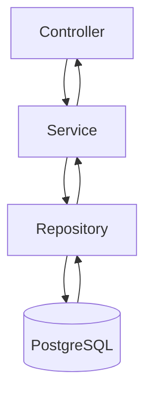
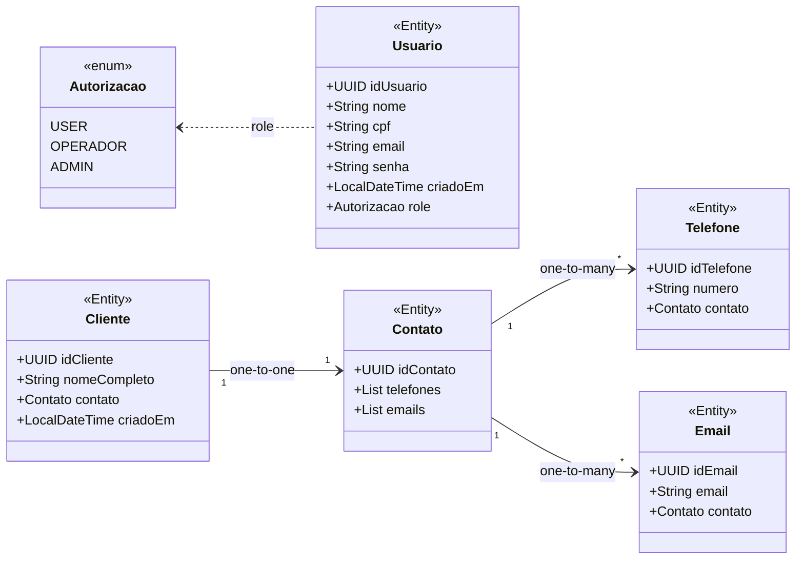

# Backend — Desafio Técnico | Casa de Apostas

## 1. Introdução

**Propósito do Projeto:**  
O **Backend Casa de Apostas** é uma API REST desenvolvida em **Java 17** com **Spring Boot 3.3.2**, responsável por gerenciar usuários, clientes e seus respectivos contatos. A aplicação fornece autenticação JWT, controle de acesso com Spring Security e persistência em banco de dados **PostgreSQL**.

O sistema foi projetado seguindo os princípios de **responsabilidade única**, **modularidade** e **escalabilidade**, garantindo clareza, manutenibilidade e segurança.

---

## 2. Início

### Pré-requisitos

Antes de rodar o projeto, é necessário ter instalado:

- **Java 17** ou superior
- **Maven** 3.8+
- **Docker** e **Docker Compose** (para execução em containers)
- **PostgreSQL** (opcional, se rodar sem Docker)

---  

### Configuração Manual do `application.properties`

Caso queira executar a aplicação fora do Docker, configure o arquivo `src/main/resources/application.properties` com suas credenciais do PostgreSQL:

```properties
spring.datasource.url=jdbc:postgresql://localhost:5432/api_desafio
spring.datasource.username=admin
spring.datasource.password=admin
spring.datasource.driver-class-name=org.postgresql.Driver

spring.jpa.show-sql=true
spring.jpa.hibernate.ddl-auto=update
spring.jpa.properties.hibernate.dialect=org.hibernate.dialect.PostgreSQLDialect
```

> **Dica:**
> 
> - Altere `spring.datasource.url` para o endereço do seu banco local, caso não esteja usando Docker.
> - Altere o nome do banco de dados (`api_desafio`), usuário (`admin`) e senha (`admin`) conforme suas preferências.
> - O modo `ddl-auto=update` cria automaticamente as tabelas no banco se ainda não existirem.
>     

---

### Instalação e Execução Manual

```bash
# Clonar o repositório
git clone https://github.com/stun106/api_desafio-casa-de-apostas.git

# Acessar o diretório do backend
cd api_desafio-casa-de-apostas

# Compilar e rodar o projeto
./mvnw spring-boot:run
```

A API será iniciada em:  
 [http://localhost:8080](http://localhost:8080/)

---

### 🐳 Executando com Docker e Docker Compose (recomendado)

O projeto inclui arquivos **Dockerfile** e **docker-compose.yml** que automatizam a criação dos containers para a API e o banco de dados PostgreSQL.

#### **1. Iniciar o ambiente completo:**

```bash
docker-compose up --build
```

#### **2. Acessar os serviços:**

- API disponível em: [http://localhost:8080](http://localhost:8080/)
- Banco de dados PostgreSQL em: `localhost:5432`
#### **3. Parar os containers:**

```bash
docker-compose down
```

O Compose inicia automaticamente:

- **db** → container com PostgreSQL configurado com `admin/admin` e banco `api_desafio`;
    
- **api** → container da aplicação Spring Boot que se conecta ao banco automaticamente.
    

---

## 3. Tecnologias

|Categoria|Ferramenta / Framework|
|---|---|
|**Linguagem**|Java 17|
|**Framework Principal**|Spring Boot 3.3.2|
|**Banco de Dados**|PostgreSQL 16|
|**ORM / Persistência**|Spring Data JPA + Hibernate|
|**Autenticação**|Spring Security + JWT|
|**Gerenciador de Dependências**|Maven|
|**Containerização**|Docker + Docker Compose|
|**Gerador de Tokens**|io.jsonwebtoken (JJWT)|
|**Logs e Erros**|SLF4J + Lombok|

---

## 4. Arquitetura e Estrutura de Pastas

### Visão Geral da Arquitetura

A arquitetura segue o padrão em **camadas (Layered Architecture)**, separando responsabilidades em Model, Repository, Service e Controller:



### 📁 Estrutura de Pastas Simplificada

```
📦 api.desafio
 ┣ 📂 jwt                  # Implementações de autenticação e geração de token JWT
 ┣ 📂 model                # Entidades e enums JPA (Usuario, Cliente, Contato, Telefone, Email, Autorizacao)
 ┣ 📂 repository           # Interfaces Spring Data JPA
 ┣ 📂 security             # Configurações de segurança (filtros, beans, policies)
 ┣ 📂 service              # Regras de negócio
 ┣ 📂 service/impl         # Implementações concretas dos serviços
 ┣ 📂 service/exception    # Classes de exceção customizadas
 ┣ 📂 web                  # Camada web (controllers, DTOs e exceções globais)
 ┣ 📂 web/controller       # Controllers REST (Auth, Usuario, Cliente)
 ┣ 📂 web/exception        # Handler global de erros (ApiExceptionHandler)
 ┣ 📂 web/dto              # Data Transfer Objects (SimplesUsuarioDto, AuthUsuarioRecord)
 ┣ 📜 pom.xml              # Dependências e build do Maven
 ┣ 📜 Dockerfile           # Build da imagem backend
 ┗ 📜 docker-compose.yml   # Orquestração da API + banco PostgreSQL
```

|Diretório|Descrição|
|---|---|
|**model/**|Entidades JPA e enums do domínio.|
|**repository/**|Interfaces de persistência.|
|**service/**|Regras de negócio e lógica de domínio.|
|**web/controller/**|Controladores REST responsáveis pelos endpoints.|
|**web/dto/**|DTOs para entrada e saída de dados.|
|**jwt/**|Lógica de autenticação e geração de tokens JWT.|
|**security/**|Configuração de segurança e filtros de autenticação.|

---

## 5. Endpoints Principais

## **Rotas publicas

### /api/v1/auth**
	`POST /` → Autentica usuário e gera `JwtToken`.
### /api/v1/usuario**
	 POST /` → Cria novo usuário.   
## **Rotas privadas

### /api/v1/usuario**
	`GET /usuarioLogado` → Retorna usuário autenticado.
	`GET /?email=` → Busca usuário por email.
	`GET /role/{email}` → Retorna a role do usuário.
### /api/v1/cliente**
	`POST /` → Cria cliente e seus contatos.
	`PUT /{idCliente}` → Atualiza cliente.
	 `GET /{idCliente}` → Retorna cliente por ID.
	`GET /`Lista todos os clientes.
	`DELETE /{idCliente}` → Deleta cliente.
	`DELETE /excluirTelefone/{idTelefone}` → Remove telefone.
	`DELETE /excluirEmail/{idEmail}` → Remove email.
    

---

## 6. Modelagem UML



---

## 7. Segurança e Autenticação

A autenticação é baseada em **JWT (JSON Web Token)**.  
Ao realizar login, o usuário recebe um token que deve ser enviado no cabeçalho `Authorization: Bearer <token>` em todas as requisições protegidas.

- **Geração do Token:** `AuthService`
- **Validação:** `JwtAuthorizationFilter`
- **Integração:** `JwtUserDetailsService` mapeia `Usuario` para `UserDetails` do Spring Security
- **Utilitário**: `JwtUtils` responsável por **gerar, validar e extrair informações** dos tokens emitidos pela aplicação.

---

## 8. Resumo Final

Este backend foi desenvolvido para ser **limpo, modular e seguro**, priorizando a separação de responsabilidades e a escalabilidade.  
Cada camada cumpre uma função específica, e a arquitetura garante fácil manutenção e expansão futura.

Desenvolvido por **José Antônio B.S JR**.
